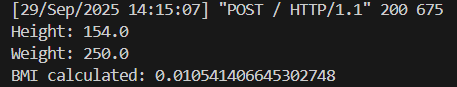

# Ex.05 Design a Website for Calculating Body Mass Index (BMI)
## Date:27/09/2025

## AIM:
 To design a website to calculate the power of a lamp filament in an incandescent bulb in the server side. 


## FORMULA:
BMI = weight / (height * height)
<br>BMI-->Body Mass Index
<br>weight
<br>height**2

## DESIGN STEPS:

### Step 1:
Clone the repository from GitHub.

### Step 2:
Create Django Admin project.

### Step 3:
Create a New App under the Django Admin project.

### Step 4:
Create python programs for views and urls to perform server side processing.

### Step 5:
Create a HTML file to implement form based input and output.

### Step 6:
Publish the website in the given URL.

## PROGRAM :
```
template.html
<!DOCTYPE html>
<html>

<head>
    <title>BMI Calculator</title>
</head>

<body bgcolor="lightblue">
    <center>
        <h2>BMI Calculator</h2>
        <form method="POST">
            
            <label>Height (m):</label><br>
            <input type="text" name="height"><br><br>
            <label>Weight (kg):</label><br>
            <input type="text" name="weight"><br><br>
            <button type="submit">Calculate</button>
        </form>


        
        <h3>Your BMI is: {{ BMI }}</h3>
        
    </center>
</body>

</html>

views.py
from django.shortcuts import render


def calculate_bmi(request):
    bmi = None   # Default value

    if request.method == "POST":
        height = float(request.POST.get("height"))
        weight = float(request.POST.get("weight"))
        bmi = weight / (height * height)

        # Print to server console for debugging
        print("Height:", height)
        print("Weight:", weight)
        print("BMI calculated:", bmi)

    return render(request, "bmiapp/template.html", {"BMI": bmi})

urls.py
"""
URL configuration for bmi project.

The `urlpatterns` list routes URLs to views. For more information please see:
    https://docs.djangoproject.com/en/5.2/topics/http/urls/
Examples:
Function views
    1. Add an import:  from my_app import views
    2. Add a URL to urlpatterns:  path('', views.home, name='home')
Class-based views
    1. Add an import:  from other_app.views import Home
    2. Add a URL to urlpatterns:  path('', Home.as_view(), name='home')
Including another URLconf
    1. Import the include() function: from django.urls import include, path
    2. Add a URL to urlpatterns:  path('blog/', include('blog.urls'))
"""
from django.contrib import admin
from django.urls import path
from bmiapp import views

urlpatterns = [
    path('admin/', admin.site.urls),
    path('', views.calculate_bmi, name='calculate_bmi'),
]
```


## BMI CALCULATOR:


## HOMEPAGE:



## RESULT:
The program for calculating Body Mass Index (BMI) is completed successfully.
